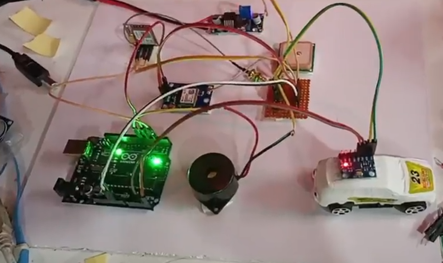

# Smart Car Accident Detection System 🚗📡



An Arduino-based IoT safety system that detects vehicle accidents and automatically sends emergency alerts containing GPS coordinates using GSM communication.

---

## 📖 Overview

Road accidents often result in delayed emergency response because victims may not be able to communicate their location. This project aims to reduce response time by automatically detecting accidents and sending an SOS alert with GPS coordinates to emergency contacts.

The system uses an Arduino Uno as the main controller, an accident detection sensor, a NEO-6M GPS module for location tracking, and a SIM800L GSM module for SMS transmission.

---

## 🎯 Objectives

- Detect vehicle accidents automatically.
- Retrieve real-time GPS coordinates.
- Send emergency SMS alerts instantly.
- Improve emergency response time.
- Provide a low-cost and portable safety solution.

---

## 🔧 Tech Stack

### Hardware
- Arduino Uno
- ADXL345 Accelerometer / Accident Detection Sensor
- NEO-6M GPS Module
- SIM800L GSM Module
- Li-ion Battery
- Jumper Wires
- Breadboard

### Software
- Arduino IDE
- Embedded C++
- TinyGPS++ Library
- SoftwareSerial Library

---

## 🚀 Features

- Real-time accident detection
- Automatic SOS message generation
- GPS-based location tracking
- GSM-based SMS alerts
- Low-cost implementation
- Portable and easy to install
- Expandable for cloud and IoT integration

---

## 🏗️ System Architecture

```text
ADXL345 / Accident Sensor
            │
            ▼
      Arduino Uno
            │
     Accident Detected
            │
            ▼
      NEO-6M GPS Module
     Fetch Coordinates
            │
            ▼
      SIM800L GSM Module
        Send SOS SMS
            │
            ▼
    Emergency Contact
```

---

## ⚙️ Working Principle

1. The accelerometer continuously monitors vehicle movement.
2. If a sudden impact exceeds the predefined threshold, an accident is assumed.
3. Arduino reads the current GPS coordinates from the NEO-6M module.
4. A Google Maps link is generated using the coordinates.
5. SIM800L sends an SOS SMS to predefined emergency contacts.
6. The recipient can directly open the location in Google Maps.

---

## 🔌 Hardware Connections

| Module | Arduino Pin |
|----------|------------|
| GPS TX | D4 |
| GPS RX | D3 |
| GSM TX | D7 |
| GSM RX | D8 |
| Accident Sensor Output | D2 |
| VCC | 5V |
| GND | GND |

---

## 📂 Project Structure

```text
Smart-Car-Accident-Detection-System
│
├── README.md
│
├── arduino_code
│   └── main.ino
│
├── docs
│   └── architecture.md
│
├── hardware
│   └── components_list.md
│
└── images
    ├── demo.jpg
    └── circuit_diagram.png
```

---

## 📸 Project Images

### Demo Setup


### Circuit Diagram


---

## 🛠️ Required Libraries

Install the following libraries from Arduino IDE:

### TinyGPS++

Used for parsing GPS data.

### SoftwareSerial

Used for serial communication with GPS and GSM modules.

---

## 📬 Sample Emergency SMS

```text
🚨 Accident Detected!

Latitude: 28.613939
Longitude: 77.209021

Location:
https://maps.google.com/?q=28.613939,77.209021

Please respond immediately.
```

---

## 💡 Future Enhancements

- Integration with IoT cloud platforms
- Mobile application support
- Emergency call functionality
- Real-time accident monitoring dashboard
- Integration with hospitals and ambulance services
- Machine Learning based accident severity prediction

---

## 📊 Applications

- Personal Vehicle Safety
- Fleet Management
- Smart Transportation Systems
- Emergency Response Systems
- Commercial Vehicle Monitoring

---

## 👨‍💻 Author

Bhaskar Kumar Jha
B.Tech Electronics & Communication Engineering  
National Institute of Technology Delhi

---

## 📜 License

This project is developed for educational and research purposes.
